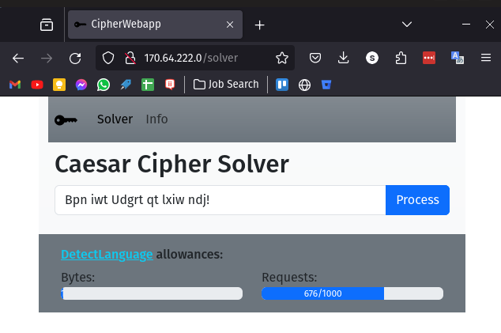

# Ruby on Rails Caesar Cipher Solver

## [DigitalOcean Hosted Site Available Here](http://170.64.222.0/)

### Description:
A webapp written in Ruby on Rails to solve Caesar Ciphers.  
The user enters a cipher into the form input on the first page, then is redirected to a page showing all possible permutations.  
Results are ranked according to the [DetectLanguage API](https://detectlanguage.com/)'s reported confidence level, and are coloured green if the confidence is above 5 and `isReliable` is true.  
In testing, the correct answer is almost always the top result, though on rare occassions it can appear second.  

Since I am using the free tier of DetectLanguage I can only support 1000 requests (~38 ciphers) per day, so I have also configured a readout at the top of each page showing how much API allowance is left. Furthermore, the form submit button will be disabled when the maximum is reached.  

I have implied a few rules from the provided example `Vjh cqn Oxaln kn frcq hxd!`:
1. Letter case is maintained (e.g. Z -> A not Z -> a)
2. Any non-alphabetic characters (e.g. spaces, punctuation) are ignored

While developing this I followed the principle of Test Driven Development, using `rspec` to define the required behaviour first and then writing the simplest code required to make the tests pass.

Since this is just a small demonstration I decided to use a cheap DigitalOcean droplet to host the website, making use of the [DigitalOcean Ruby on Rails Droplet Template](https://marketplace.digitalocean.com/apps/ruby-on-rails).  

### Local Usage:  
Must have a DetectLanguage API key configured in the `DETECT_LANGUAGE_KEY` environment variable.  
`bundle install`  
`bin/rails server`  
Navigate to the root page at `http://127.0.0.1:3000/`

### Output:
Homepage:  

Results:  
